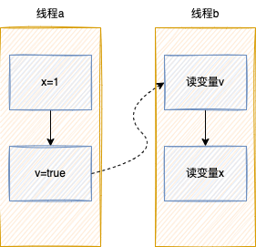
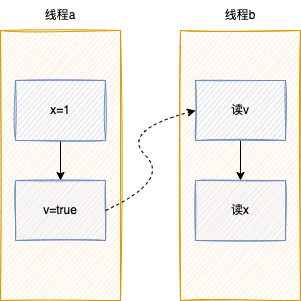
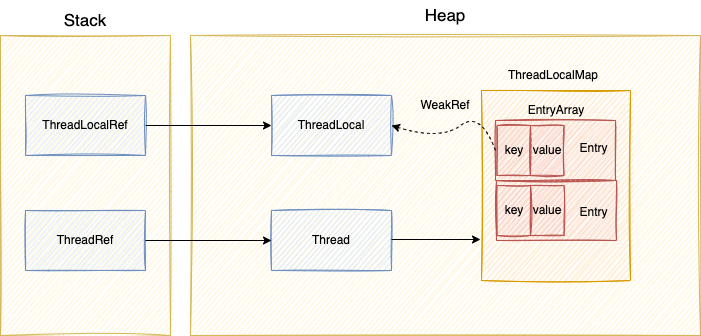

## 线程和进程
#### 进程
系统进行资源调度和分配的的基本单位。  
#### 线程
系统可识别的最小执行和调度单位。
#### 联系
一个进程可以有多个线程。进程向系统申请分配资源，进程所开的线程共享这些资源，并执行任务。（java单进程，多线程）  

如下示例图：  

#### 线程的上下文切换  
* 释义：一个进程分配一个核心。一个核心单位时间内只能执行一个任务。对于多个线程，cpu进程时间分片，上下文切换。保证多个任务的执行。
* 触发时机：线程的sleep、wait、join、lock等操作会触发上下文的切换。或者线程被分配的时间片用完，也会上下文切换

#### 线程的并发与并行
线程的并发：表示单位时间内有多个任务进行  
线程的并行：表示单位时间内有多个任务肩并肩执行

## 多线程
多线程提高了程序执行效率，但同时带来线程安全问题。当多个线程对同一资源进行操作的时候，可能会出现不一致的问题。

如下假设有100张票，两个线程同时买票。

```
public class PlayGround {
    private static Integer total = 100;
    static class Thread1 extends Thread{
        @Override
        public void run() {
            while (true){
                if(total > 0){
                    try {
                        Thread.sleep(100);
                    } catch (InterruptedException e) {
                        e.printStackTrace();
                    }
                    total--;
                } else {
                    System.out.println(Thread.currentThread().getName() + "-total:" + total);
                    break;
                }
            }
        }
    }
    
    同上声明Thread2...

    public static void main(String[] args) throws Exception{
        new Thread1().start();
        new Thread2().start();
    }
}   

输出：
Thread-0-total:0
Thread-1-total:-1
```
结果如上，出现了负票的情况，出现线程不安全的情况。

为了解决多线程线程安全问题，引入了三个并发特性，只要遵循这三个特性，就是线程安全的。

#### 原子性  
即一个操作或多个操作，要么全部执行，要么就都不执。执行过程中，不能被打断。比如变量i++，可分解为三个操作：获取i的值、i值加1、赋值给i。如果i++三个操作原子性不能保证，可能会出现如下情况



正确结果应为i=2，出现了线程不安全。所以要线程安全，必须保证原子性

#### 有序性	
保证代码执行是有序的。实际处理过程编译器和处理器会对代码的执行顺序重排序，充分的利用计算机资源，提高执行效率。

```
int a;
int b;
a =0;//语句1
b =1;//语句2
```
程序执行时，语句1和语句2不一定按照定义的顺序执行。  

单线程下遵循as-if-serial语义。不管怎么重排序，as-if-serial语义保证最终执行结果是正确的。

```
int a;
int b;
a =0;//语句1
b = a + 1;//语句2
```
由于b的值依赖于a，语句2必须在语句1后执行。即如果一个指令2必须用到指令1的结果，
那么处理器会保证指令1会在指令2之前执行。  

所以重排序不会影响单个线程的执行，但是会影响到线程并发执行的正确性。

#### 可见性
一个线程对同一份数据的修改，如果对其他线程可见的。就说改数据是可见的，否则不可见。

```
public class PlayGround {     
    private static boolean ready = false;

    private static class Thread1 extends Thread {
        public void run() {
            while(!ready) {
            }
            System.out.println("break");
        }
    }

    private static class Thread2 extends Thread {
        public void run() {
            ready = true;
        }
    }

    public static void main(String[] args) throws Exception{
        Thread thread1 = new Thread1();
        thread1.start();

        Thread.sleep(1000);

        Thread thread2 = new Thread2();
        thread2.start();
    }
}
```
实际情况：线程2修改ready变量值，线程1不可见，使得线程1一直在轮询。

因为java的内存模型，才会有不可见的问题。


如上是java内存模型图，在主内存中存储共享变量，并且在每个线程中，都有一个共享变量的副本。同时对数据的操作规则有如下规定：

* 线程只能对本线程的变量副本操作，不能直接操作主内存中的变量
* 不同线程之间无法直接访问彼此的变量，必须经过主内存的同步

所以默认情况下，变量的变更不同线程不能感知到，即没有可见性

## synchronized和volatile
为了解决多线程的线程安全问题，java引入了synchronized和volatile关键字。一定程度上解决了原子性，有序性，可见性问题

#### synchronized 
synchronized可以修饰方法（静态和非静态）和代码块

```
//修饰实例方法，锁定实例对象
public synchronized String getName() {
    return "";
}
//修饰静态方法，锁定类
public synchronized static String getName() {
    return "";
}
//修饰代码块，锁定传入的实例
public String getName() {
    synchronized (this){
       return "";
    }
}
```
#### synchronized下三个特性
原子性，有序性  
synchronized保证方法或者代码块运行时，同一时刻只有一个线程执行，保证了原子性和有序性

可见性  
synchronized规定：

* 线程解锁前：必须把线程共享变量副本的最新值刷到主内存中
* 线程加锁时：清空线程变量副本值，从主内存中重新读取最新的值

以上规则保证了可见性

```
//声明锁对象
private static Object lock = new Object();

public void run() {
    while (true){
    	//加锁
        synchronized (lock){
            if(total > 0){
                try {
                    Thread.sleep(100);
                } catch (InterruptedException e) {
                    e.printStackTrace();
                }
                total--;
            } else {
                System.out.println(Thread.currentThread().getName() + "-total:" + total);
                break;
            }
        }
    }
}
```
在之前卖票的例子的基础上，声明一个锁对象。不同线程使用synchronized锁定同一对象，即可保证线程安全。

#### Happens-before规则

Happens-before规则是JMM中的一种，保障内存可见性的方案。使用Happens-before规则约束编辑器优化，允许编译器优化，但必须遵守一定的Happens-before规则，如果一个操作的执行结果对另一个操作可见，那么这两个操作必须遵守Happens-before规则。

* 一个线程中的每个操作，Happens-before与该线程中任意后续操作。

```
int a=0;//语句1
int b = a + 1;//语句2
语句2依赖于语句1，语句1 Happens-before 语句2
``` 

* 一个锁的解锁，Happens-before于随后对这个锁的加锁。

```
线程a
//this加锁
synchronized (this) { 
	 
} 
//this解锁

then

线程b
//this加锁
synchronized (this) { 
	 
} 
//this解锁

线程a的解锁 Happens-before 线程b加锁
```

* 对一个volatile域的写，Happens-before于任意后续对volatile域的读。

* A happens-before B，且B happens-before C，则么A happens-before C。

```
class PlayGround {
  int x = 0;
  volatile boolean v = false;
  public void writer() {
    x = 1;
    v = true;
  }
  public void reader() {
    if (v == true) {
    }
  }
}
```



如上流程：

1. 写v Happens-before 读v，遵循第三条规则
2. 写x Happens-before 写v，写v Happens-before 读v，则写x Happens-before 读v。遵循第四条规则

#### volatile
volatile可以保证多线程场景下变量的可见性和有序性。

* 可见性：保证此变量的修改对所有线程的可见性
* 有序性：遵循Happens-before规则，禁止指令重排序优化，编译器和处理器在进行指令优化时，不能把在volatile变量操作(读/写)后面的语句放到其前面执行，也不能将volatile变量操作前面的语句放在其后执行。

针对java内存模型图的数据操作规定，volatile又做如下规定

* 写volatile变量

	1. 写本地线程变量值
	2. 把改变后的值更新到主内存

* 读volatile变量
	1. 读主存的值，并更新本地线程的值
	2. 读取本地线程值

经过以上过程，保证了volatile修饰的变量的可见性

```
private static volatile boolean ready = false;
```
之前可见性问题，加上volatile关键字。a线程值的修改，b线程能感知到。


#### synchronized vs volatile

| 操作   | synchronized | volatile |
|--------|--------------|----------|
| 加锁   | yes          | no       |
| 原子性 | yes          | no      |
| 有序性 | yes          | yes       |
| 可见性 | yes          | yes      |


## 死锁
死锁是两个或者两个以上的线程，互相持有锁，并等待对方释放锁。没有外力的打破，线程会一直等待一下，造成死等待。


```
public class Deadlock {
    private final static Object a = new Object();
    private static final Object b = new Object();

    public static void main(String[] args) throws Exception{
        Thread threadA = new Thread(()->{
            synchronized (a) {
                try {
                    System.out.println("threadA locka");
                    Thread.sleep(1000l);
                    synchronized (b) {
                        System.out.println("threadA lockb");
                    }
                } catch (Exception e) {
                }
            }
        });

        Thread threadB = new Thread(()->{
            synchronized (b) {
                try {
                    System.out.println("threadB lockb");
                    Thread.sleep(1000);
                    synchronized (a) {
                        System.out.println("threadB locka");
                    }
                } catch (Exception e) {
                }
            }
        });
        threadA.start();
        threadB.start();
    }
}
```
如上，线程A先锁定a，获取b锁。线程B先锁定b，获取a锁。由于a，b锁都还在锁定，因此以上两个线程都无法再获取到锁，造成死锁。

#### 检测死锁

查询程序的pid，使用jstack检测程序的死锁

```
jstack -l 681

Found one Java-level deadlock:
=============================
"Thread-1":
  waiting to lock monitor 0x00007fd958006218 (object 0x00000000ec05ee80, a java.lang.Object),
  which is held by "Thread-0"
"Thread-0":
  waiting to lock monitor 0x00007fd958003988 (object 0x00000000ec05ee90, a java.lang.Object),
  which is held by "Thread-1"
```
选择对应进程，使用arthas检测死锁

```
查看线程状态，BLOCKED表示阻塞
[arthas@12156]$ thread
Threads Total: 26, NEW: 0, RUNNABLE: 8, BLOCKED: 2, WAITING: 4, TIMED_WAITING: 2, TERMINATED: 0, Internal threads: 10
ID   NAME                            GROUP           PRIORITY  STATE      %CPU      DELTA_TIME TIME      INTERRUPTE DAEMON
10   Thread-1                        main            5         BLOCKED    0.01      0.000      0:0.014   false      false
9    Thread-0                        main            5         BLOCKED    0.01      0.000      0:0.016   false      false

找出阻塞的线程
[arthas@12156]$ thread -b
"Thread-0" Id=9 BLOCKED on java.lang.Object@23e57780 owned by "Thread-1" Id=10
    at Deadlock.lambda$main$0(Deadlock.java:17)
    -  blocked on java.lang.Object@23e57780
    -  locked java.lang.Object@6da63065 <---- but blocks 1 other threads!
    at Deadlock$$Lambda$1/531885035.run(Unknown Source)
    at java.lang.Thread.run(Thread.java:748)
```


## 线程池

#### 定义
线程池ThreadPool就是定义一组线程，供任务调度和使用。由于线程的创建开销很大，所以不能频繁的创建线程。预先定义一些线程，并根据任务的数量，动态的调整线程的数量，从而达到消耗和任务处理的平衡。

#### 优点
 1. 通过线程的复用，降低线程频繁开关的性能损耗
 2. 预先定义一些线程，当有任务需要处理的时候，减少线程创建等待时间，降低响应时间
 3. 使用线程池可以进行统一的分片、调优和监控线程

#### 实现原理
预先定义一批线程，并动态的扩展线程数量，当任务数量大于线程数时，创建队列存储任务，有空闲线程时再处理任务。一般线程池有如下参数配置，决定了整个线程池的流程节点。

|参数名| 释义|
|-----|-----|
|corePoolSize|核心线程数，小于等于核心数时，线程不会回收|
|maxPoolSize|创建线程的最大线程数|
|keepAliveTime|线程的保持存活时间|
|workQueue|任务存储队列（SynchronousQueue：不存储任务、LinkedBlockingQueue：无界队列、ArrayBlockingQueue：有界队列） |
|ThreadFactory|线程池创建新线程的线程工厂类|
|Handler|线程无法接收任务时的拒绝策略|

线程池创建线程池流程


 
#### 创建方式
自动创建：通过Executors类能快速的创建不同类型线程池

```
//创建固定线程数池
public static ExecutorService newFixedThreadPool(int nThreads) {
    return new ThreadPoolExecutor(nThreads, nThreads,0L, TimeUnit.MILLISECONDS,new LinkedBlockingQueue<Runnable>());
}

//创建单线程数池
public static ExecutorService newSingleThreadExecutor() {
    return new FinalizableDelegatedExecutorService(new ThreadPoolExecutor(1, 1,0L, TimeUnit.MILLISECONDS,new LinkedBlockingQueue<Runnable>()));
}

//创建线程池（最大数量Integer.MAX_VALUE）
public static ExecutorService newCachedThreadPool() {
    return new ThreadPoolExecutor(0, Integer.MAX_VALUE,60L, TimeUnit.SECONDS,new SynchronousQueue<Runnable>());
}
...

```
手动创建

由于使用Executors创建的线程池，可能会使用LinkedBlockingQueue无界队列，或者不限制线程数，当有大量任务时，可能会OOM。实际环境中，一般使用ThreadPoolExecutor类传自定义参数创建线程池

```
public ThreadPoolExecutor(int corePoolSize,int maximumPoolSize,long keepAliveTime,TimeUnit unit,BlockingQueue<Runnable> workQueue) {
    this(corePoolSize, maximumPoolSize, keepAliveTime, unit, workQueue,Executors.defaultThreadFactory(), defaultHandler);
}
```


## ThreadLocal
ThreadLocal类提供线程变量操作的类，通过get set可以存储和取用一些数据。这些数据是线程隔离的。

#### set方法

threadLocal的set方法

```java
public void set(T value) {
    //获取当前线程
    Thread t = Thread.currentThread();
    //获取map
    ThreadLocalMap map = getMap(t);
    if (map != null)
    //赋值
    map.set(this, value);
    else
    //创建map
    createMap(t, value);
}
```
其中创建map流程如下

```
void createMap(Thread t, T firstValue) {
    t.threadLocals = new ThreadLocalMap(this, firstValue);
}

ThreadLocalMap(ThreadLocal<?> firstKey, Object firstValue) {
    //Entry数组，默认长度16
    table = new Entry[INITIAL_CAPACITY];
    //获取ThreadLocal hash值并计算index
    int i = firstKey.threadLocalHashCode & (INITIAL_CAPACITY - 1);
    //放入index位置上
    table[i] = new Entry(firstKey, firstValue);
    size = 1;
    setThreshold(INITIAL_CAPACITY);
}
```
因此ThreadLocal set的值，最终存在Thread里。并且是用一个数组存储的。数组里存储Entry对象。

Entry定义如下

```
static class Entry extends WeakReference<ThreadLocal<?>>
```
当一个对象仅仅被weak reference（弱引用）指向, 而没有任何其他strong reference（强引用）指向的时候, 如果这时GC运行, 那么这个对象就会被回收。因此ThreadLocal会被Entry包裹，使Entry数组对ThreadLocal是弱引用的，当ThreadLocal销毁的时候，不会因为Entry数组的引用而无法GC。

如下图：



#### 内存泄露
如上分析，当ThreadLocal被GC时，Thread任然存活的时候。Entry的key为null，value任然强引用某个对象。使得value对象无法GC，从而造成内存泄露。