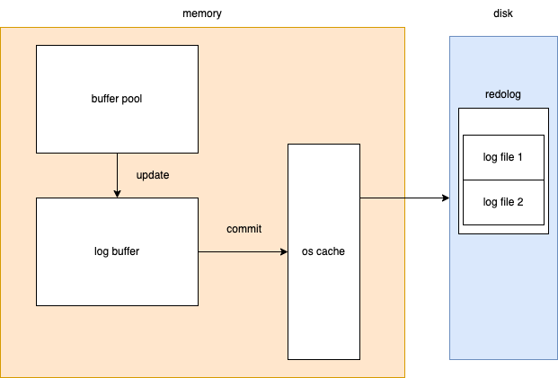
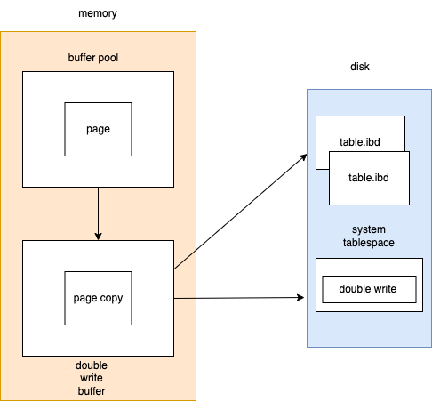
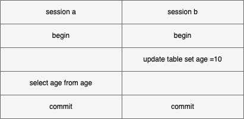
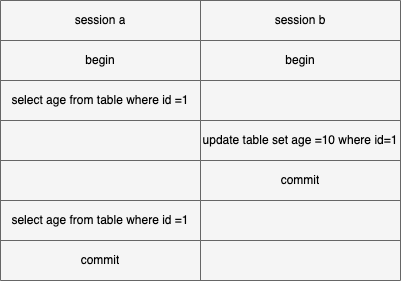
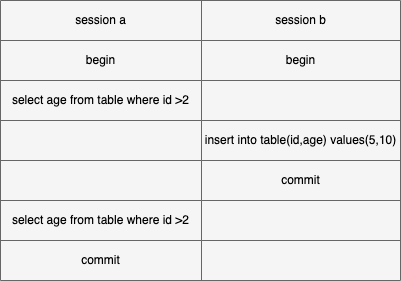

## 一条SQL语句在MySQL中的执行过程
分析sql语句如下

```
 UPDATE table SET field = value WHERE id =6
```
### Server层
* 建立连接：连接建立和权限校验
* 分析sql语句：词法分析（把sql语句分割成一个个字符串并识别含义）、语法分析（检查语句是否符合mysql语法）、预处理（检查表、字段是否存在、用户是否有权限）
* sql语句优化：根据语句生成不同的执行计划，对比不同的计划，选择最优的计划
* 执行sql语句：判断用户对操作的表是否有权限。

### 存储引擎层（InnoDB）

#### 查询数据
更新操作首先会查询符合条件的数据，并以页为单位（默认16k）把数据放到内存中。然后对内存中的数据执行更新操作。因为内存中的数据和磁盘中页数据不一致，通常把内存中的数据成为脏页。InnoDB使用B+数存储数据，行完整数据都存放在树的叶子结点上，非叶子结点是聚簇索引构成的，如下树的大概构造：


查询过程  

 1. 6<8,查询8所在的p1结点
 2. 6>4,查询4所在的p2结点
 3. 遍历p2指向的叶子结点，读取第一个节点id=5不等于6。向后继续读，第二次找到id=6的结点

#### 更新数据

##### 记录log
数据在内存更新后，不直接写入磁盘。而是先写入redolog



写入过程

1. buffer pool写入更新
2. 更新后，把更新操作写入log buffer中
3. 默认事务提交后，把log buffer中的内容刷到系统缓存
4. 写入磁盘

#### 数据落盘
双写把脏页刷到数据盘中



写入过程

1. 从buffer pool，拷贝一份脏页副本到double write buffer中
2. 把double write buffer写入到系统表空间对应的双写区（顺序写）
3. 把double write buffer写到具体表，具体页位置

## 事务

#### ACID特性
Atomicity（原子性）：事务内的操作是一个统一整体，要么全部成功，要么全部失败  
Consistency（一致性）：事务前后数据的状态是一致的，必须是从一个一致性的状态到另一个一致性的状态  
Isolation（隔离性）：不同事务之间，数据相互隔离的性质，隔离级别决定隔离的不同  
Durability（Durability）：事务提交后，数据能持久化  

#### 隔离级别

| 级别                   | 描述                                           |
|------------------------|------------------------------------------------|
| Read Uncommitted（RU） | 读未提交，一个事务读到另一个事务没有提交的数据 |
| Read Committed（RC）   | 读已提交，一个事务读到另一个事务已经提交的数据 |
| Repeatable Read（RR）  | 可重复读，在一个事务中读到的数据始终保持一致   |
| Serializable           | 串行化，同时只能执行一个事务                   |

#### 并发问题

脏读：一个事务读到了另一个事务未提交的数据。如下b事务age=10还未提交，a事务读到age=10。



不可重复读：一个事务读到了另一个事务已经提交的数据吗，导致事务多次查询结果不一致。如下a事务查询数据，b事务更新数据并提交，a事务再次读取数据，和第一次结果不一致。  



幻读：一个事务读到了另一个事务已经插入的数据。导致事务中多次查询的结果不一致。如下a事务读取数据，b事务插入数据并提交。a事务读取到b事务提交的数据



不同隔离级别下，各种读问题是否出现

| 级别         | 脏读 | 不可重读读 | 幻读 |
|--------------|------|------------|------|
| RU           | yes  | yes        | yes  |
| RC           | no   | yes        | yes  |
| RR           | no   | no         | yes  |
| serializable | no   | no         | no   |


#### 安全性、性能与隔离级别的关系
安全性： serializable > repeatable read > read committed > read uncommitted  
性能 ： serializable < repeatable read < read committed < read uncommitted
