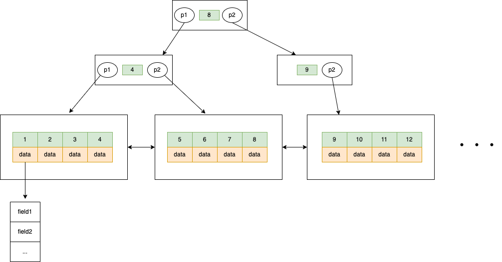

## 一条SQL语句在MySQL中的执行过程
分析sql语句如下

```
 UPDATE table SET field = value WHERE id =1
```
### Server层
* 建立连接：连接建立和权限校验
* 分析sql语句：词法分析（把sql语句分割成一个个字符串）、语法分析（检查语句是否符合mysql语法）、预处理（检查表表、字段是否存在、用户是否有权限）
* sql语句优化：根据语句生成不同的执行计划，对比不同的计划，选择最优的计划
* 执行sql语句：判断用户对操作的表是否有权限。

### 存储引擎层（InnoDB）

#### 查询数据
mysql数据的更新，首先会查询符合条件的数据，并以页为单位（默认16k）把数据放到内存中。然后对内存中的数据执行更新操作。因为内存中的数据和磁盘中页数据不一致，通常把内存中的数据成为脏页。InnoDB使用B+数存储数据，行完整数据都存放在树的叶子结点上，非叶子结点是聚簇索引构成的。如下如查询过程：



#### 更新数据


## 事务
#### ACID特性
#### 隔离级别
#### 并发问题
#### 安全性、性能与隔离级别的关系

