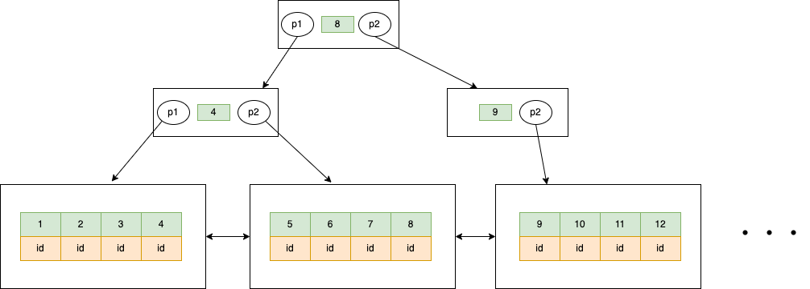
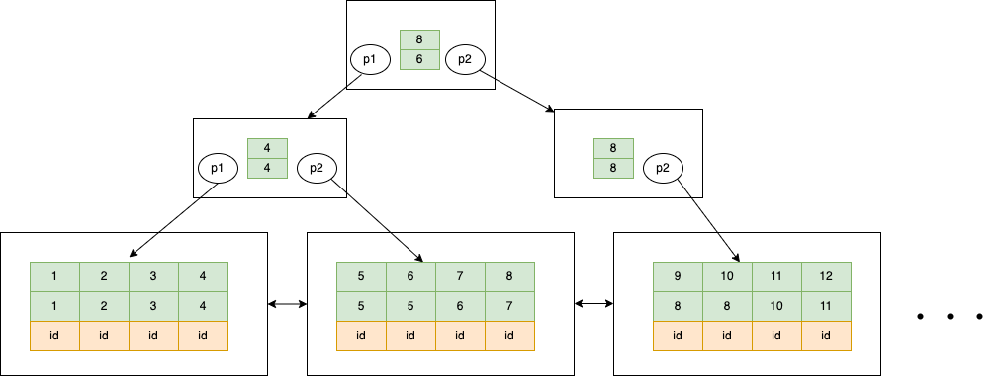

## RC(READ COMMITTED) RR(REPEATABLE READ)隔离级别

### RC 可见性操作

开启两个session，并设置两个session隔离级别为RC

```
set session transaction isolation level READ COMMITTED;
```
|session 1| session 2|
|---------|----------|
| ```mysql> BEGIN;``` <br> ```Query OK, 0 rows affected (0.01 sec)```| ```mysql> BEGIN;``` <br> ```Query OK, 0 rows affected (0.01 sec)```|
|```mysql> UPDATE `tag` SET `name`='test' WHERE id = 1;``` <br> ```Query OK, 1 row affected (0.01 sec)```||
||```mysql> SELECT name FROM `tag` WHERE id =1;``` <br> ```name == ?????```|
|```mysql> COMMIT;``` <br> ```Query OK, 0 rows affected (0.01 sec)```||
||```mysql> SELECT name FROM `tag` WHERE id =1;``` ```name == test```|
||```mysql> COMMIT;``` ```Query OK, 0 rows affected (0.01 sec)```|

如上，在RC隔离级别下。当一个事务提交修改，其他事务能读到最新的修改。

### RR 可见性操作

开启两个session，并设置两个session隔离级别为RR

```
set session transaction isolation level REPEATABLE READ;
```

|session 1| session 2|
|---------|----------|
| ```mysql> BEGIN;``` <br> ```Query OK, 0 rows affected (0.01 sec)```| ```mysql> BEGIN;``` <br> ```Query OK, 0 rows affected (0.01 sec)```|
|```mysql> UPDATE `tag` SET `name`='test' WHERE id = 1;``` <br> ```Query OK, 1 row affected (0.01 sec)```||
||```mysql> SELECT name FROM `tag` WHERE id =1;``` <br> ```name == aaa```|
|```mysql> COMMIT;``` <br> ```Query OK, 0 rows affected (0.01 sec)```||
||```mysql> SELECT name FROM `tag` WHERE id =1;``` ```name == aaa```|
||```mysql> COMMIT;``` ```Query OK, 0 rows affected (0.01 sec)```|

如上，在RR隔离级别下。当一个事务提交修改，其他事务只能读到事务开始时的数据。

## MVCC

以上，在RR RC隔离级别下，不同事务读取到的数据不同。而InnDb通过MVCC(Multi-Version Concurrency Control)机制来实现。开启MVCC时，会生成Undo日志和ReadView，在这两种数据的配合下，来实现数据的隔离。

### Undo日志
在多版本的实现下，必定要存多版本的数据。undo日志就是用来存储多版本数据的快照。  

如下undo日志的结构:

*  row id：innodb隐藏的主键id
*  trx id：事务id，当有事务提交时，会拷贝完整的一行数据。并设置trx id的值为当前事务的id
*  roll pointer：回滚指针，指向拷贝源数据的地址，用于回滚操作。
*  field：表中具体定义字段数据


### ReadView
有了Undo记录的历史数据，就要设置不同事务对那些版本数据是可见的，哪些数据是不可见的。InnDb用ReadView来记录事务开始时的事务顺序快照，并通过ReadView来判断数据的可见性。
如下ReadView结构:

 * m\_low\_limit\_id：当前系统中活跃的读写事务中最小的事务id
 * m\_ids：当前系统中活跃的读写事务id列表
 * m\_up\_limit_id：生成ReadView时，系统中应该分配给下一个事务的id值
 * m\_creator\_trx\_id：生成该ReadView的事务的事务id


 ReadView判断逻辑如下  
 
 * Undo.trx_id < ReadView.m\_low\_limit\_id，表明生成该版本的事务在生成 ReadView 前已经提交，所以该版本可以被当前事务访问  
 * Undo.trx\_id == ReadView.m\_creator\_trx\_id，表明当前事务产生的数据，数据是可见的
 * Undo.trx\_id >= ReadView.m\_up\_limit_id，表示在生成ReadView后才产
生的数据，所以该版本数据不可见。  
 * 当Undo中trx\_id属性值，处在m\_low\_limit\_id和m\_up\_limit_id中间时，如果在m\_ids中，表明事务还在活跃，数据不可见。当不在m\_ids中时，表明事务已经提交完毕，数据是可见的

## RR RC可见性分析

设session 1的trx\_id为2。设session 2的trx\_id为3。在以上两个不同事务下，会产生如下的Undo日志  


### RR 分析

  

RR级别下，在第一次读取时会产生如上的ReadView，遇到第一条Undo日志时，trx\_id为2，在m_ids里，表明事务还在活跃，此版本的数据不可见。找下一个版本的数据，判断数据可见。查到值为aaa。第二次查询时，依旧使用事务开始生成的ReadView，得到相同的值。
### RC 分析

  

RC级别下，和RR判断逻辑一致。只能读到aaa值。第二读时，会再生成新的ReadView，由于session 1事务已经提交。m_ids里的事物id去除。所以第二次读的时候，能读取到Undo日志的最新数据test。

综上所述，InnDb在RR RC下开启MVCC机制，使用Undo日志和ReadView实现数据的隔离。并且ReadView		生成时机的不同，造成RR RC不同的数据隔离表现。


## 索引(InnoDb)

数据库中提高数据检索的一种结构，默认使用B+树的数据结构。

### 优劣势

优势：

 * 提高数据检索，减少io次数  
 * 索引列天然有序，对索引列排序性能高

劣势：

 * 会增加索引B+树，额外增加存储空间
 * 索引列表更新有所降低

### 种类

聚簇索引（主键索引）：InnoDb每个表，都会有一个主键id，如果不指定主键，会使用默认的主键。索引树把主键id当做非叶子结点，有序的进行排列，叶子结点存储完整的行数据。以此构造的索引叫聚簇索引。

二级索引（辅助索引）：用户指定索引列构建的索引。索引树按照索引列有序排列，叶子结点存储索引列的数据和主键id。以此构造的索引叫二级索引。

### 数据结构

B+树（树的检索效率相对较高，为了尽可能多的排序索引列，使用多路树。并且非叶子结点不存储数据，能容纳更多的索引列）：  

* 每个节点的子节点个数不能超过m，也不能小于 m/2.（数的每个结点默认固定16k，m的取值由主键索引大小确定）
* 根节点的子节点个数可以小于 m/2
* m叉树非叶子只存储索引，并不存储真实的数据，真实数据存储在叶子结点
* 叶子结点之间有双向链结点，构成一个双向链表


聚簇索引如下结构：  

使用主键排序，构建索引树，叶子结点存储完整的记录。


二级索引（单列）：  
按照定义的索引列排序，构建单列二级索引树。叶子结点存储的是索引列和主键id



二级索引（多列）：  
按照多列索引定义的位置，先按照第一个索引单列排序。第一列索引单列相等的情况下，按照第二列索引排序，依次类推，构建出二级索引树。叶子结点存储的是索引列和主键id。



### 检索流程

聚簇索引检索：  

* 查索引树的根节点，比对值。如果小于根节点值，走p1节点向下检索。如果大于根节点值，走p2节点向下检索
* 一次类推，知道检索到数据所在的叶子结点
* 遍历叶子结点，找到对应的数据记录

二级索引检索：  

* 检索过程同聚簇索引
* 找到对应的叶子结点，如果查询列全部在改索引树找到，则检索结束
* 如果检索列多余二级索引的列，则用记录里的id，回到聚簇索引树里继续检索，直到找到记录。
